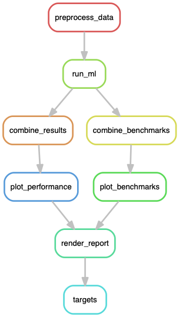

# Machine learning classification of microbiome data

This workflow is adapted from the [Snakemake](https://snakemake.readthedocs.io/en/stable/) pipeline of [mikropml](http://www.schlosslab.org/mikropml/) developed by the Schloss lab.

For more details on these tools, see the
[Snakemake tutorial](https://snakemake.readthedocs.io/en/stable/tutorial/tutorial.html)
and read the [mikropml docs](http://www.schlosslab.org/mikropml/).

## The Workflow

The [`Snakefile`](Snakefile) contains rules which define the output files we want and how to make them.
Snakemake automatically builds a directed acyclic graph (DAG) of jobs to figure
out the dependencies of each of the rules and what order to run them in.
This workflow preprocesses the example dataset, calls `mikropml::run_ml()`
for each seed and ML method set in the config file,
combines the results files, plots performance results 
(cross-validation and test AUROCs, hyperparameter AUROCs from cross-validation, and benchmark performance),
and renders a simple [R Markdown report](report.Rmd) with a summary.

<p align="center">
  
</p>

## Installation

1. Install [conda](https://conda.io/projects/conda/en/latest/user-guide/install/index.html ) and [snakemake](https://snakemake.readthedocs.io/en/stable/getting_started/installation.html)

2. Clone repository
```
git clone https://github.com/alexmsalmeida/ml-microbiome.git
```

## How to run

1. Edit the configuration file [`config/config.yml`](config/config.yml).
    - `dataset`: the path to the dataset as a csv file.
    - `outcome_colname`: column name of the outcomes for the dataset.
    - `ml_methods`: list of machine learning methods to use. Must be supported by mikropml.
    - `kfold`: k number for k-fold cross validation during model training.
    - `ncores`: the number of cores to use for preprocessing and for each `mikropml::run_ml()` call. Do not exceed the number of cores you have available.
    - `nseeds`: the number of different random seeds to use for training models with `mikropml::run_ml()`.

2. (option 1) Run the pipeline locally (adjust `-j` based on the number of available cores)
```
snakemake --use-conda -k -j 4
```
2. (option 2) Run the pipeline on a cluster (e.g., LSF)
```
snakemake --use-conda -k -j 100 --profile config/lsf --latency-wait 90
```

3. View the results in `results/report.md`.

By default, the pipeline will not estimate feature importance as this is very time consuming. However, a separate script to perform this analysis can be found in `code/get_ml-features.R`.
